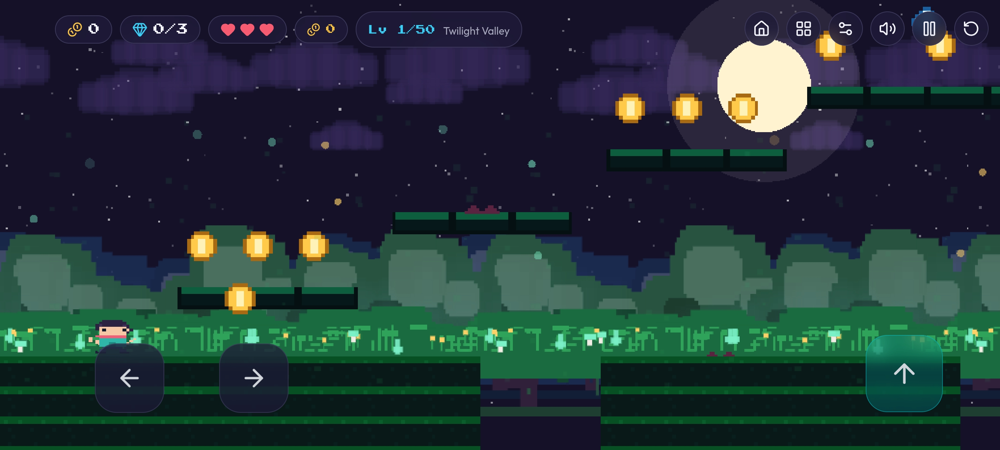
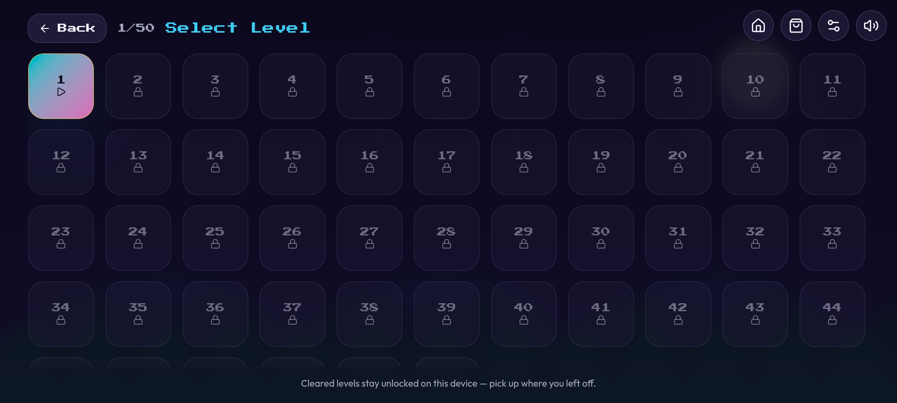
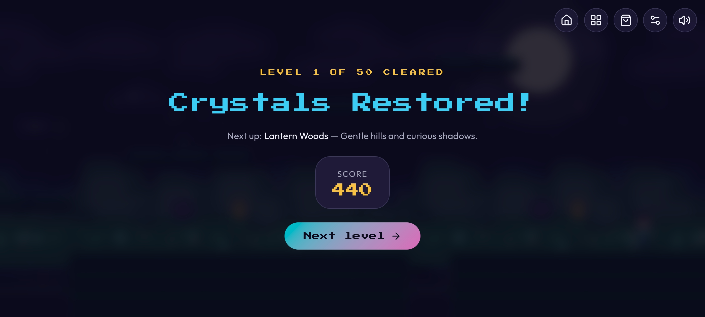
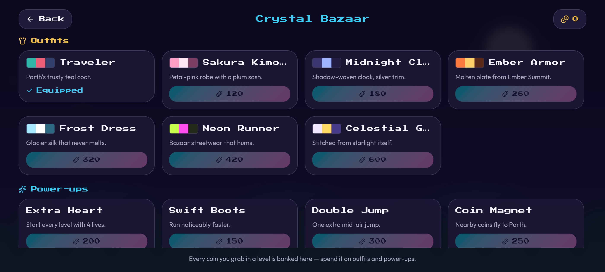
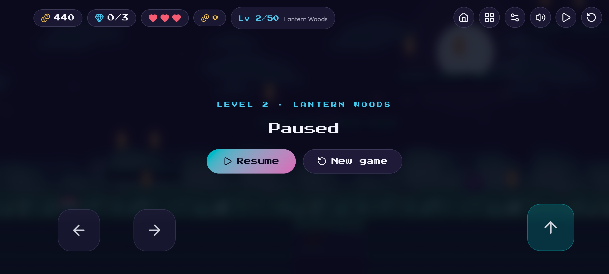

give me a step by step guide on adding a good readme file with screenshots and adding apk file to realease in github for my parths anime quest game

Absolutely. For Parth's Anime Quest, I’d set it up like a proper portfolio-quality GitHub project: a polished README, screenshots stored in the repository, a clear project structure, and the APK attached to a GitHub Release.

GitHub Releases are specifically designed for distributing compiled software such as APKs, and each release can have downloadable binary assets. 

🎮 What the final GitHub page should look like
Ideally, your repository should have something like:

Parths-Anime-Quest/
│
├── README.md
├── LICENSE
│
├── screenshots/
│   ├── gameplay.png
│   ├── main-menu.png
│   ├── map.png
│   ├── pause-menu.png
│   └── settings.png
│
├── app/
├── gradle/
├── build.gradle
├── settings.gradle
└── ...
And your GitHub page should have:

🎮 Parth's Anime Quest

[Banner / Hero]

A short description

[Download APK] [Latest Release]

📸 Screenshots
    screenshot  screenshot  screenshot

✨ Features

🎮 Gameplay

🗺️ Exploration

🔊 Audio

⚙️ Technical Details

🚀 Installation

📦 Releases

🛠️ Built With

👨‍💻 Developer
Step 1 — Prepare your screenshots
First, take screenshots from your latest APK.

I'd recommend around 5–7 screenshots.

For your game, something like:

Main menu

Character/gameplay

Map

Mid-game exploration

Pause/control screen

Settings

Another visually interesting gameplay scene

Don't put screenshots directly into the README from your computer. Instead, create a dedicated folder.

Create:

screenshots
Then rename your screenshots clearly:

main-menu.png
gameplay.png
map.png
pause-menu.png
settings.png
exploration.png
PNG is preferable for UI screenshots.

Step 2 — Put the screenshots inside your GitHub repository
If you already have the project cloned locally:

Open your project folder.

Create:

screenshots
Then copy your images into it.

For example:

Parths-Anime-Quest/
│
├── screenshots/
│   ├── main-menu.png
│   ├── gameplay.png
│   ├── map.png
│   ├── pause-menu.png
│   └── settings.png
│
├── app/
└── README.md
Step 3 — Create your README.md
At the root of your project, you should have:

README.md
Not:

app/README.md
It should be:

Parths-Anime-Quest/
└── README.md
GitHub automatically displays the root README.md on your repository's main page.

Step 4 — Add a proper README
For your game, I'd recommend a README that feels more like an actual game/project page rather than a generic coding README.

Here's a good structure:

🎮 Parth's Anime Quest

  

 <b>An anime-inspired adventure and exploration game built for Android.</b> 

    

🌟 About The Game
Parth's Anime Quest is an anime-inspired adventure game focused on exploration, progression, and interactive gameplay.

Explore the world, navigate through different areas, overcome challenges, and continue your quest as you progress through the game.

The project was developed as a personal game development project with a focus on creating an engaging Android gaming experience.

✨ Features
🎮 Interactive gameplay

🗺️ Explore an adventure map

⚔️ Anime-inspired adventure experience

🧭 Map-based exploration

⏸️ Pause and resume gameplay

🎛️ In-game controls

🔊 Game audio

💾 Game progression

📱 Designed for Android devices

⚡ Smooth and lightweight gameplay

📸 Screenshots
🏠 Main Menu

  

🎮 Gameplay

  

🗺️ Map

  

⏸️ Pause / Controls

  

⚙️ Settings

  

🎮 Gameplay
The game focuses on exploration and progression.

Players can:

Navigate through the game world

Explore different areas

Interact with the game environment

Use the in-game controls

Open the map during gameplay

Pause and resume the game

Continue their adventure from their current progress

📱 Platform
Platform	Support
Android	✅ Supported
Windows	❌ Not currently supported
iOS	❌ Not currently supported
🚀 Installation
Option 1 — Download the APK
Download the latest APK from the Releases section:

⬇️ Download Latest APK

Option 2 — Install manually
Download the latest .apk file from Releases.

Transfer the APK to your Android device if necessary.

Open the APK.

Allow installation from unknown sources if Android asks for permission.

Install the game.

Launch Parth's Anime Quest.

⚠️ Only download APK files from releases published in this repository.

🛠️ Built With
Android

Java / Kotlin

Android Studio

Git

GitHub

Update this section with the exact technologies and frameworks used by the project.

📦 Releases
Version	Description
v1.0.0	Initial playable release
For the latest version, visit:

📦 GitHub Releases

🗺️ Roadmap
✅ Completed
Core gameplay

Game map

Player controls

Pause system

Android APK

Initial release

🔄 Planned
Additional areas

More quests

Additional characters

More gameplay mechanics

Performance improvements

Additional content

🐛 Known Issues
If you encounter a bug, please open an issue with:

Device model

Android version

Game version

Description of the problem

Screenshots or screen recording if possible

🤝 Contributing
Contributions, suggestions, and bug reports are welcome.

If you find an issue or have an idea for improving the game, open an issue in this repository.

👨‍💻 Developer
Aryandra Gupta
Cloud / DevOps Engineer in the Making
Android • Game Development • Cloud • DevOps • Linux

📄 License
This project is licensed under the license included in this repository.

 Made with ❤️ and lots of debugging 🎮 

Important: replace:

YOUR_USERNAME
YOUR_REPOSITORY
with your actual GitHub username and repository name.

Also remove or modify anything that doesn't accurately describe your game. In particular, the Built With section should match what you actually used.

Step 5 — Commit the README and screenshots
Open your terminal inside the project.

Run:

git status
You should see something similar to:

README.md
screenshots/main-menu.png
screenshots/gameplay.png
screenshots/map.png
...
Then:

git add README.md screenshots/
Commit:

git commit -m "docs: update README with game screenshots"
Then push:

git push origin main
If your branch is called master, use:

git push origin master
Step 6 — Check your GitHub repository
Open your repository on GitHub.

You should now see:

Parths-Anime-Quest

README
   ↓
🎮 Parth's Anime Quest
And your screenshots should appear inside the README.

If an image doesn't appear, check that the path is exactly:

screenshots/gameplay.png
and that the actual file is:

screenshots/gameplay.png
GitHub paths are case-sensitive in many environments, so:

Gameplay.png
is not necessarily the same as:

gameplay.png
Step 7 — Prepare your APK
Now let's handle the important part: don't put your APK directly inside the repository unless you have a specific reason to.

For a release build, GitHub Releases are the better place to distribute it. GitHub explicitly supports attaching binary files such as compiled programs to releases. 

For example:

Parths-Anime-Quest-v1.0.0.apk
I'd recommend a versioned name instead of:

game.apk
or:

final.apk
Step 8 — Make sure you're using the correct APK
For Android Studio, your APK will usually be somewhere like:

app/build/outputs/apk/release/
You might see:

app-release.apk
Rename/copy it to:

Parths-Anime-Quest-v1.0.0.apk
Don't upload a debug APK if you're presenting this as your proper public release.

Ideally use your signed release APK.

Step 9 — Create a GitHub Release
Go to your GitHub repository.

On the repository page, find:

Releases

Then:

Draft a new release

GitHub's current release workflow lets you create/select a tag, give the release a title and description, and drag/drop binary files into the release assets area. 

Step 10 — Create your version tag
For your first proper release, use:

v1.0.0
This is a good convention because it clearly represents the first stable version.

You can later have:

v1.0.1
v1.1.0
v1.2.0
v2.0.0
For example:

v1.0.0
   │
   ├── Parths-Anime-Quest-v1.0.0.apk
   └── Source code
GitHub Releases are tied to Git tags, which identify the specific version of your repository being released. 

Step 11 — Give the release a professional title
Use:

Parth's Anime Quest v1.0.0
Not:

final
or:

new apk
Step 12 — Add release notes
You can use something like:

🎮 Parth's Anime Quest v1.0.0
The first public playable release of Parth's Anime Quest.

✨ Features
🎮 Core gameplay

🗺️ Adventure map

🧭 Exploration system

🎛️ Player controls

⏸️ Pause and resume functionality

⚙️ Settings

📱 Android support

🐛 Bug Fixes
Improved gameplay stability

Improved background/game pause behavior

Improved audio handling when leaving the game

General performance improvements

📱 Installation
Download:

Parths-Anime-Quest-v1.0.0.apk

Install the APK on your Android device and launch the game.

⚠️ Note
This is the first public release. More features, improvements, and content may be added in future versions.

Adjust the bug-fix section if those aren't actually part of this release.

Step 13 — Upload your APK
On the release page you'll see an area similar to:

Attach binaries by dropping them here or selecting them.
Drag:

Parths-Anime-Quest-v1.0.0.apk
into that area.

You should then see:

Assets

Parths-Anime-Quest-v1.0.0.apk
GitHub supports release assets as downloadable binary files; individual release assets can be up to 2 GiB. 

Step 14 — Publish the release
Make sure:

Tag: v1.0.0

Title:
Parth's Anime Quest v1.0.0

APK:
Parths-Anime-Quest-v1.0.0.apk
Then click:

Publish release

Now your APK is officially attached to your release.

Step 15 — Test the download
This is important.

Go to:

Releases → v1.0.0

You should see:

Parth's Anime Quest v1.0.0

Assets

⬇ Parths-Anime-Quest-v1.0.0.apk
Download it yourself.

Install it on your phone.

Make sure:

APK installs

Game launches

Game doesn't crash

Audio works correctly

Pause works

Exiting the game behaves correctly

Map works

Controls work

Progress works

Only after testing should you consider v1.0.0 your proper public release.

⭐ One extra thing I'd recommend
Add a Download APK button near the top of the README.

For example:

  

That way someone visiting your repository doesn't have to hunt around.

They see:

🎮 PARTH'S ANIME QUEST

    [ ⬇ DOWNLOAD APK ]

    📸 Screenshots
    ✨ Features
    🎮 Gameplay
Much more professional.

🔥 Your final repository structure
I'd aim for:

Parths-Anime-Quest/
│
├── 📄 README.md
├── 📄 LICENSE
│
├── 📁 screenshots/
│   ├── 🖼️ main-menu.png
│   ├── 🖼️ gameplay.png
│   ├── 🖼️ map.png
│   ├── 🖼️ pause-menu.png
│   ├── 🖼️ settings.png
│   └── 🖼️ exploration.png
│
├── 📁 app/
├── 📁 gradle/
│
├── 📄 build.gradle
├── 📄 settings.gradle
└── ...
And separately:

GitHub Releases
│
└── v1.0.0
    │
    ├── 📦 Parths-Anime-Quest-v1.0.0.apk
    └── 📝 Release Notes
This is better than committing the APK into your normal source tree.

🚀 If you want to make it really polished
Since you're using this project as part of your GitHub portfolio, I'd go one step further and make the README visually impressive:

Top

             🎮 PARTH'S ANIME QUEST

       An Anime-Inspired Adventure Game

       [ DOWNLOAD APK ]  [ VIEW RELEASES ]

             ┌─────────────────┐
             │                 │
             │  GAME SCREEN    │
             │                 │
             └─────────────────┘
Then:

✨ Features
🎮 Gameplay
📸 Screenshots
🗺️ World & Exploration
⚙️ Technical Details
📱 Installation
🚀 Roadmap
🐛 Known Issues
👨‍💻 Developer
And use your actual screenshots, rather than generic images. That will make the repository look like a real game project rather than just another Android source-code repository.

If you want, send me the GitHub repository link and the screenshots you want to use, and I can create the final, copy-paste-ready README specifically for your Parth's Anime Quest project, including the correct image paths, badges, sections, animations, APK download button, and release section.

07187e80-ba25-4c09-bffb-b11bd7d493ad.png
Create a ReadMe with updated screenshots and here is github repo link guptaaryandra/parth-s-pixel-quest

Done — I created a copy-paste-ready README.md specifically for your parth-s-pixel-quest repository, using the exact screenshot filenames visible in your GitHub repository.

📥 Download the README

What I included
🎮 Professional game title/hero section

⬇️ Download Latest APK button

GitHub badges

🌟 Game overview

✨ Features based on your actual screenshots

📸 All 8 screenshots from your screenshots/ folder

🎮 Gameplay section

📱 Android installation instructions

📦 GitHub Releases section

🗺️ Roadmap

🐛 Bug-report instructions

👨‍💻 Developer section

⭐ Star-the-repository CTA

Proper relative image paths for GitHub

I used relative paths such as ./screenshots/Gameplay.jpeg, which GitHub recommends for images stored inside the repository. 

Your next step
Download the file and replace the existing:

README.md
in your repository with this one.

Then commit:

git add README.md
git commit -m "docs: update README with game screenshots"
git push origin main
One important thing: I kept the README based on what is actually visible in your repository/screenshot, rather than inventing game mechanics. Once you upload your APK as a GitHub Release, the Download APK buttons in this README will automatically point users to the latest release. 

Library
/
README.md

🎮 Parth's Pixel Quest

  

 <strong>An anime-inspired pixel adventure game built for Android.</strong> 

   

🌟 About The Game
Parth's Pixel Quest is a pixel-art adventure game designed for Android, combining exploration, level progression, interactive controls, a shop system, and an anime-inspired visual style.

The game is built around progressing through levels, exploring the game world, managing gameplay settings, and completing challenges along the way.

✨ Features
🎮 Pixel-art adventure gameplay

🗺️ Multiple playable levels

🏆 Level completion system

🛍️ In-game shop

🎛️ Custom gameplay controls

⏸️ Pause menu

🔊 Music & SFX controls

📱 Android gameplay experience

🎨 Anime-inspired pixel-art presentation

🚀 Lightweight and focused gameplay experience

📸 Screenshots
🏠 Main Menu

  

🎮 Gameplay

  

🗺️ Levels

  

🏆 Level Cleared

  

🛍️ Shop

  

🎛️ Controls & Settings

  

🔊 Music & SFX Settings

  

⏸️ Pause Screen

  

🎮 Gameplay
The game provides a simple and accessible adventure experience with:

Character movement and gameplay controls

Level-based progression

A dedicated level selection screen

Level completion feedback

An in-game shop

Pause and resume functionality

Separate music and sound-effects controls

📱 Android
Parth's Pixel Quest is currently distributed as an Android APK.

Installation
Open the Releases section of this repository.

Download the latest Parths-Pixel-Quest-*.apk file.

Transfer/open the APK on your Android device.

If prompted, allow installation from the source you used to download the APK.

Install and launch the game.

⚠️ For the safest installation, download the APK only from the Releases section of this repository.

⬇️ Download the Latest APK

  

🛠️ Project Structure
The repository contains the game's Android project, source code, build configuration, and documentation assets.

parth-s-pixel-quest/
├── android/
├── dist-android/
├── public/
├── screenshots/
│   ├── Controls Setting.jpeg
│   ├── Gameplay.jpeg
│   ├── Level-Cleared.jpeg
│   ├── Levels.jpeg
│   ├── Main menu.jpeg
│   ├── Music&Sfx Setting.jpeg
│   ├── Pause-Screen.jpeg
│   └── Shop.jpeg
├── src/
├── README.md
└── ...
🚀 Releases
All playable Android builds are distributed through GitHub Releases.

Latest Release
⬇️ Download the Latest APK

Future releases can include:

New levels

Gameplay improvements

Bug fixes

New content

Performance improvements

New features

🗺️ Roadmap
✅ Current
Android build

Core gameplay

Level progression

Level completion screen

Controls/settings

Music & SFX settings

Pause screen

Shop

Public APK distribution

🔄 Future Improvements
More levels and environments

Additional gameplay mechanics

More shop content

Additional characters/content

Further performance optimization

Additional polish and effects

🐛 Bug Reports & Feedback
Found a bug or have an idea for the game?

Please open a GitHub Issue and include:

Device model

Android version

Game version

Steps to reproduce the issue

Screenshot or screen recording, if available

🐛 Report an Issue

👨‍💻 Developer
Aryandra Gupta

Cloud / DevOps Engineer in the Making
Android • Game Development • Cloud • DevOps • Linux

  

📄 License
See the repository for the applicable license and project terms.

 <strong>🎮 Built with passion, pixels, and plenty of debugging.</strong> 

 ⭐ If you like the project, consider giving the repository a star! 

